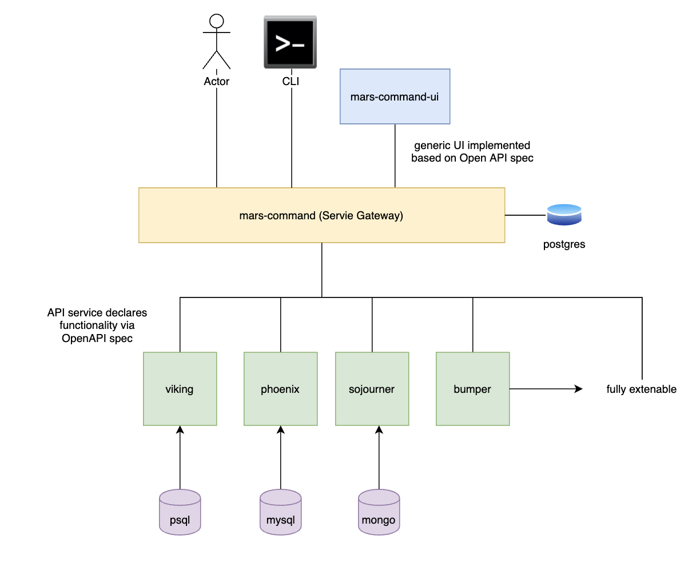

# Prototyping a Service Gateway Using an API Gateway and Service Discovery

The [API Gateways](https://www.nginx.com/learn/api-gateway/) and [Service Discovery](https://www.nginx.com/blog/service-discovery-in-a-microservices-architecture/) patterns are at the foundation of microservice best practice. In this exercise, we're going to implement a dynamic API Gateway utilizing Service Discovery to build a scaling function registry.

The goal of this prototype is to create a thin application that can easily assume additional functionality from underlying APIs while presenting a single API for usage. This application will be accessible from a UI, an API (direct requests), and a CLI application.

I'm a big fan of all things space related so we'll uses mars themed service names.

## Implementation: Mars Command



[Mars Command](https://github.com/jstone28/mars-command) is our Service Gateway

Endpoints:

- `/register`   - `POST`  - register your service's openAPI spec as it comes online
- `/services`   - `GET`   - List registered services
- `/functions`  - `GET`   - List of available functionality of all services
- `/health`     - `GET`   - [Internal] registered service health check

`/register`

This endpoint accepts a `POST` request of a JSON Object containing the service name as well as the openapi spec in JSON format. The object looks like:

```json
{
    "name": "mars-viking",
    "spec": "..."
}
```

This data is stored in a postgres database by mars-command. A heartbeat is then set within mars-command to ensure that mars-viking is accessible.

## Implementation: Mars Viking
